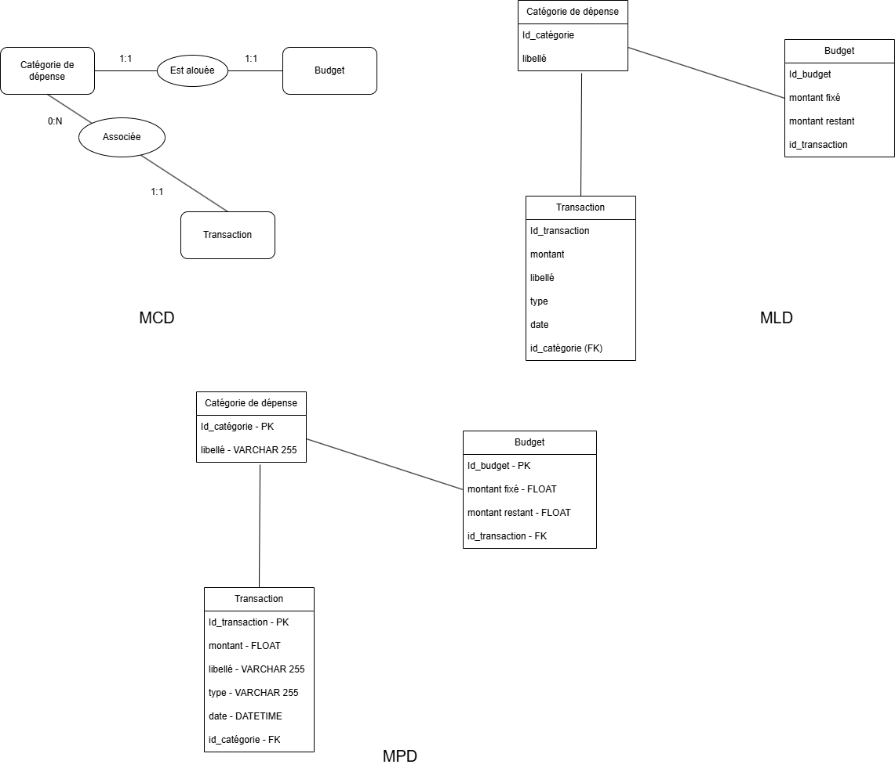

# Bienvenue sur le projet de gestion des finances pour le cours de "Tests"

Réalisé par : Mathilde Ageron, Alexandre Blanc, Massine Bankoussa et Victor Bechet

# BACKEND

**Structure du backend :**

Le backend est composé de 6 éléments :

- Le dossier routes -> Exposent les routes de l'API.

- Le dossier controllers -> Gèrent l'arrivée des requètent, le formattage, gère les 
erreurs, puis appelle le service associé.

- Le dossier services -> Gère la logique métier et les opérations SQL.

- Le dossier middlewares -> Contient du code qui s'exécute entre les routes (uniquement de la gestion d'erreur centralisée actuellement).

- Les fichier app.js et server.js -> servent à la config du serveur.

- Le fichier db.js -> Sert pour la config de la base de données.

---
# FRONTEND

**Structure du frontend :**

Le frontend est une application Angular 19 composée de :

- Le dossier components -> Contient les composants Angular (home, categories, transactions).

- Le dossier services -> Services HTTP pour communiquer avec l'API backend (budget.service.ts, category.service.ts, transaction.service.ts).

- Le fichier app.routes.ts -> Configuration du routage de l'application.

---
# LANCER LE PROJET

**Prérequis :**

- Docker Desktop installé et lancé

**Étapes :**

- Créer un .env à la racine du projet avec :

```
DB_HOST=db
DB_PORT=5432
DB_USER=user
DB_PASSWORD=user-pwd
DB_NAME=mybudget
```

- Lancer la commande suivante pour démarrer l'ensemble du projet :

```bash
docker compose up --build
```

**Accès aux services :**

- Frontend (Angular) : http://localhost:4200
- Backend (API) : http://localhost:3000
- Base de données (PostgreSQL) : localhost:5432

- Tester la connexion backend avec : http://localhost:3000/health/db -> ok true now "Date actuelle"

- En cas de problème, rebuild le conteneur avec :

```bash
docker compose down -v
docker compose up --build
```

---
# TESTS

```bash
cd Backend
npm test                  # Lancer tous les tests
npm run test:coverage     # Voir la couverture (objectif : 80%)
```

---
# Base De Données

**Le schéma de la base de donnée :**



---
# Fonctionnalités

**MVP :**
- Saisie de transactions (revenus/dépenses)
- Gestion des budgets par catégorie
- Filtres : type, date, catégorie

**Feature B : Alertes budgétaires**
- Alerte WARNING à 80% du budget
- Alerte OVER_BUDGET si dépassement
- Endpoint : `GET /budgets/alerts`